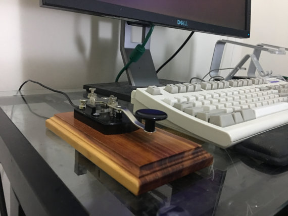

# Arduino Morse Code Keyboard
This is the Arduino-based firmware powering the handmade [USB morse code telegraph keys](http://lzrwlkr.me/morsekey) I sell on [Etsy](http://lzrwlkr.me/morsekey).

This repo contains an Arduino sketch that presents as a HID keyboard device, translating button presses representing morse code characters into ASCII characters.

My eventual intent is to open-source the other aspects of the hardware (a full parts list + instructions, and the model for the 3D-printed microcontroller mount), but this is what there is for now.

If you like this project, please consider [purchasing](http://lzrwlkr.me/morsekey) a USB telegraph key from me! Your financial support helps me continue to make weird things like this.

## Usage
Clone this repo. Open `morse.ino` in the Arduino IDE. My production hardware uses a [Teensy LC](https://www.pjrc.com/store/teensylc.html), which also requires the [Teensyduino](https://www.pjrc.com/teensy/teensyduino.html) software to be installed to add Teensy LC support to Arduino.

If you're trying to use this with a non-Teensy microcontroller, there may be slight modifications needed to enable keyboard HID support.

## Hard Reset

If you find your telegraph key is in a weird set, there's a `reset` sketch that takes all persistent EEPROM state and resets it to the default state. This EEPROM state will normally persist beyond a power cycle or even a reflash of the sketch, so this sketch will be necessary. 

After running `reset.ino`, you'll need to reflash the normal `morse.ino` sketch.

## License
This source code is available under the MIT license. See the `LICENSE` file for more information.

## Contact
Mike Lazer-Walker

- https://github.com/lazerwalker
- [@lazerwalker](http://twitter.com/lazerwalker)
- http://lazerwalker.com